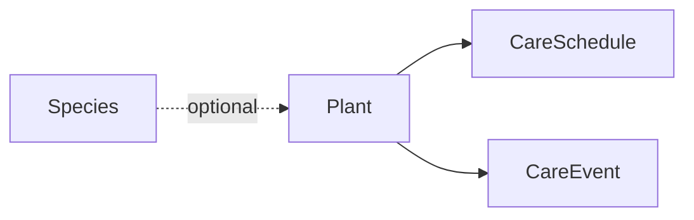
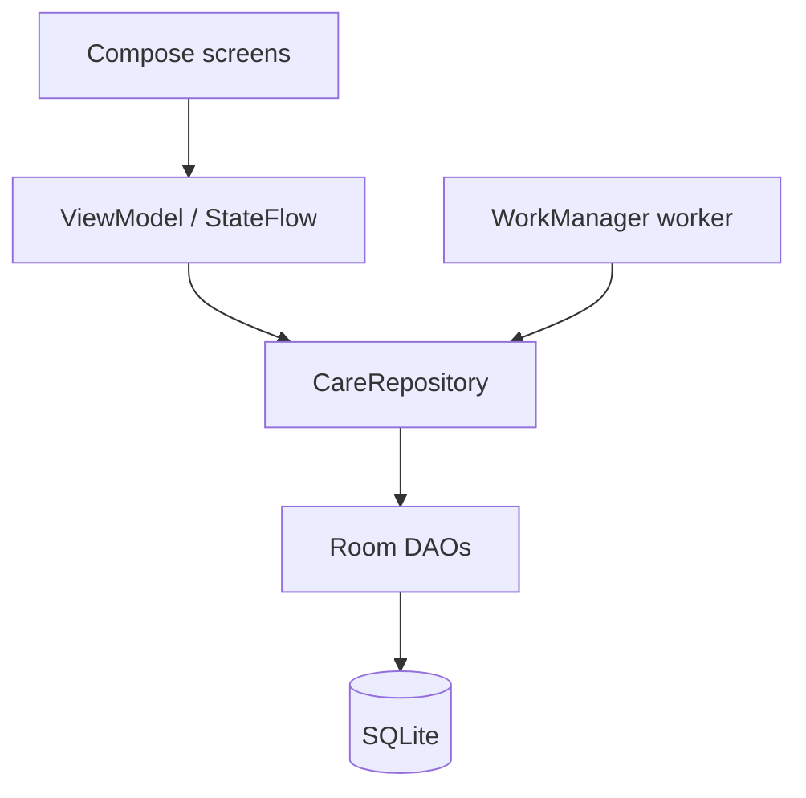

# Houseplant Care App — PRD

2026-09-20 · @Someone

## Problem & Target User

Houseplants need care on irregular, per-plant schedules that are too much to track mentally, so care becomes reactive and plants underperform.

**User:** One person with a modest collection — roughly 5–30 houseplants. Cares about them, but the watering schedule currently lives entirely in their head. Not a botanist, not a collector with 200 specimens and a spreadsheet. Mobile-first, because care happens while standing in front of the plant.

**Why generic reminders fail:** A calendar alert doesn't know which plant, doesn't adapt when you water early, and doesn't account for a plant in a dim corner versus a south window. The result is plants that survive rather than thrive.

**Framing constraint:** This is a personal project, built to scratch the author's own itch. That is the strongest scope constraint available — anything that exists to serve *other people's* plants (identification, a large species database, community features) is out by default.

## Core User Journey

The one flow that must work: open the app, see what needs care, mark it done in one tap.

1. Open the app. The screen shows what is due today and what is overdue. Nothing else competes for attention.
2. Read a row: plant name, location, what it needs, how overdue it is.
3. Tap the row to mark it done. The app timestamps it and advances the next due date by that plant's interval.
4. Optionally tap into the plant for detail: care history, notes, its schedule.
5. When the list is empty, the app says so and gets out of the way.

Adding a plant is a separate, less frequent flow: name, location, watering interval. Three fields.

**Two decisions built into this flow:**

- The home screen is a task list, not a plant gallery. A gallery answers "what do I own"; the task list answers "what do I need to do."
- Completing care recalculates from the date it was actually done, not the date it was due. Water three days late and the next due date shifts three days.

## MVP Scope

**In scope**

- Add, edit, delete a plant: name, location, watering interval, optional photo
- Home screen: due today plus overdue, sorted by how overdue
- One-tap "watered" with timestamp
- Per-plant care history
- Daily local notification summarizing what is due, at a fixed time
- Local persistence surviving app restarts

**Out of scope, deliberately**

| Excluded | Reason |
| --- | --- |
| Fertilizing, repotting, misting | Watering only; the schema leaves room |
| Species catalog and autofill | MVP2 |
| Plant grid / gallery view | MVP2 |
| Sharing, accounts, cloud sync | Later; needs a server and a permissions model |
| Seasonal interval adjustment | A rules engine hiding behind a small feature |
| Photo timelines, growth tracking, health diagnosis | Not the stated problem |
| Light, humidity, sensors | Not the stated problem |

**On notifications:** they are in the MVP because the stated pain is forgetting, and an app you have to remember to open does not solve forgetting. The MVP version is one daily summary — not one notification per plant, which trains the user to dismiss them without reading.

**If the build had to shrink:** drop the photo and edit/delete. Add-only is survivable for a personal v1. That leaves add plant, see what's due, tap done.

## Data Model

Four tables. Species exists but goes unused until the catalog arrives.

| Entity | Fields | Notes |
| --- | --- | --- |
| Plant | id, name, location, photo, species\_id (nullable), created\_at, archived\_at | Soft delete keeps history intact |
| CareSchedule | id, plant\_id, care\_type, interval\_days, next\_due\_on | One row per plant today |
| CareEvent | id, plant\_id, care\_type, completed\_at, notes (nullable) | The care log |
| Species | id, common\_name, scientific\_name, default\_interval\_days | Stubbed for MVP2 |

Plant has many CareSchedules and many CareEvents. Plant optionally belongs to Species.

**Three choices worth flagging:**

- `care_type` is an enum with one value today. It looks redundant now and saves a migration when fertilizing arrives. Same reasoning for CareSchedule being its own table rather than an `interval_days` column on Plant.
- `next_due_on` is denormalized. It could be derived from the last CareEvent plus the interval, but then every home-screen render computes over history. Storing it makes "what's due today" one indexed query, which the notification worker also reads. Cost: it can drift if a write fails halfway, so the event insert and the schedule update go in one transaction.
- Location is free text. It becomes a real entity when the grid needs grouping by room. Migrating a text column to a foreign key on personal-scale data is a non-event.

## Tech Stack

Kotlin, Jetpack Compose, Room (SQLite), WorkManager for the daily notification. No backend, no network.

**Reasoning:** the app is roughly 20% CRUD and 80% "does the reminder actually fire." Reliable local scheduling is the core risk, and native removes a layer from exactly where the fragility is. Android-only is the stated scope, so the main benefit of cross-platform — free iOS — buys nothing yet. Room also gives compile-time-checked queries that map cleanly onto the schema above.

| Option | Strength | Cost |
| --- | --- | --- |
| Kotlin + Compose + Room | Best notification and background-scheduling story; native throughout | Android only; steepest learning curve from Python |
| Flutter + Drift | One codebase, iOS nearly free, Dart is comfortable from Python | A plugin layer sits exactly where the platform is fussiest |
| React Native + Expo | Fastest to a running app if you know JS | Background scheduling and local notifications are the weakest part of Expo |

**Revisit if:** iOS becomes a real requirement, or sharing and sync arrive and a server is needed anyway.

## Architecture

Single-module MVVM. No backend, no network, no auth — nothing leaves the device.

- **UI** — Compose screens: PlantList (home), PlantDetail, AddEditPlant. Each has a ViewModel exposing one immutable state object as a `StateFlow`.
- **Domain** — `CareRepository` owns the operation that matters: `completeCare(plantId, careType, at)`. It inserts the CareEvent and advances `next_due_on` in a single Room `@Transaction`. Everything else is thin reads.
- **Data** — Room entities matching the model above. DAOs return `Flow<List<DuePlant>>` so the home screen recomposes after a completion. One query drives the home screen: schedules where `next_due_on <= today`, joined to plant, ordered by due date ascending.

**Notification job:** a WorkManager periodic worker constrained near the chosen time of day, plus a check on app launch to catch a deferred run. The worker reads the same DAO the home screen uses and posts one summary notification when the count is non-zero. Tapping it deep-links to home.

**Known risks**

| Risk | Handling |
| --- | --- |
| WorkManager periodic minimum is 15 min and timing drifts | Acceptable for a daily digest; switch to AlarmManager `setExactAndAllowWhileIdle` only if exact timing matters (costs a permission on Android 12+) |
| Reminders stop silently after a reboot | Reschedule on `BOOT_COMPLETED` |
| OEM battery optimization kills background work | Verify on the actual device early; surface a settings hint if it bites |

**Module layout:** single module until it hurts — `ui/`, `domain/`, `data/` as packages. Hilt optional; manual construction is fine at this size.

## Build Order

Step 3 is the target. Everything after it is improvement rather than construction.

1. **Room schema and DAOs, with tests.** No UI. Prove `completeCare` advances the date correctly, including completion four days late.
2. **Home screen.** Seed a few plants through the DAO. Get the due/overdue list and one-tap completion working end to end.
3. **Add and edit plant.** First usable build — start tracking real plants here, since real use will reorder everything below.
4. **Notifications.** Worker, summary notification, deep link, boot receiver.
5. **Plant detail and care history.**
6. **Photo.**
7. **Polish:** delete, empty states, whatever two weeks of real use reveals.

## Decisions & Deferred Work

**Decided**

| Decision | Reason |
| --- | --- |
| Single-user MVP, no accounts | Personal project; strongest available scope constraint |
| Home is a task list, not a gallery | Answers "what do I need to do," which is the stated problem |
| Intervals recalculate from completion date | Matches how care actually happens |
| Notifications in MVP, one daily digest | Stated pain is forgetting; per-plant alerts train dismissal |
| Local notifications only, no push server | No backend to justify |
| `care_type` enum from day one | Avoids a migration when fertilizing arrives |
| `next_due_on` denormalized, written transactionally | Makes the home query and the worker query trivial |
| Kotlin, Compose, Room | Scheduling reliability is the core risk |

**Deferred**

| Item | Notes |
| --- | --- |
| Plant grid / gallery view | MVP2 |
| Species catalog | MVP2. Plant references Species rather than embedding care data, so this is cheap to add later |
| Sharing / multi-user | Later. Don't build toward it, but avoid a schema that assumes one owner forever |
| Configurable notification aggressiveness | Frequency, digest vs per-plant, quiet hours, escalation when overdue |
| Additional care types | Fertilize, repot, mist — the enum and schedule table already allow it |

**Open questions**

- [ ] What time of day should the daily digest fire?
- [ ] Does overdue need visual escalation, or is sort order enough?
